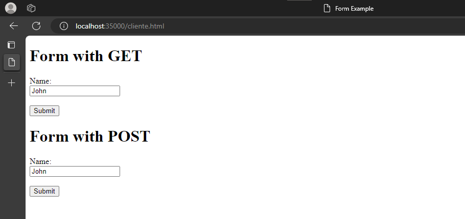
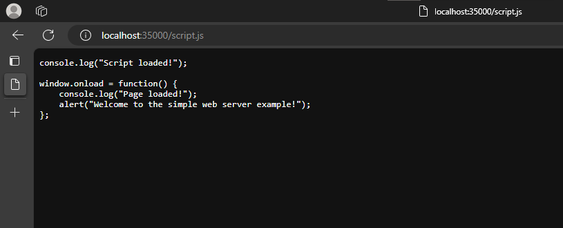
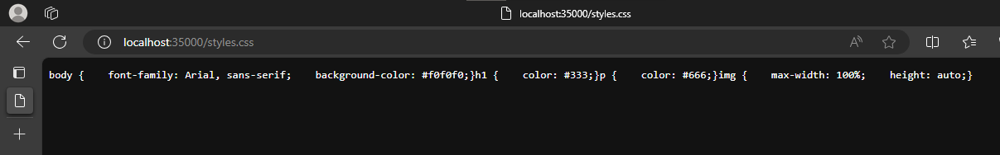
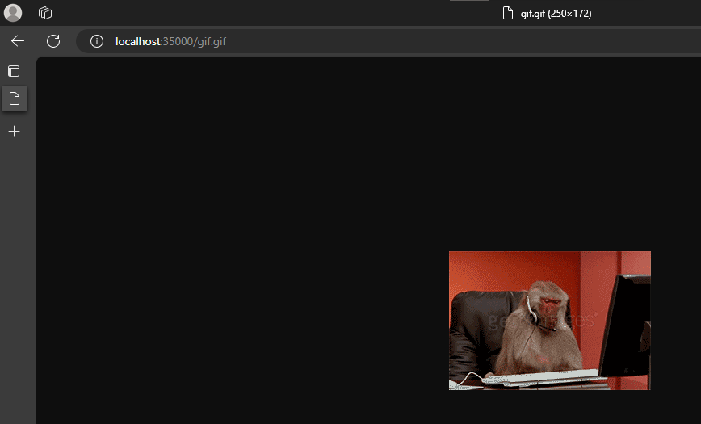

# Laboratorio 2 de AREP - Carlos Alberto Sorza Gómez

## Descripción
Este laboratorio se centra en la implementación de un servidor Web, el cual sirve para leer cualquier tipo de archivo y leerlo desde disco y mostrarlo desde cualquier navegador.

## Pre-requisitos
- JAVA
- Git
- Maven

## Instalación
1. Mediante el comando git clone https://github.com/CarlosSorza/AREP_Lab2.git
2. En la carpeta appweb abrimos una consola

3. Y ejecutamos mvn clean y luego mvn package

## Uso
1. Estando en Firefox en el buscador ponemos http://localhost:35000/cliente.html
    
2. Realizamos la búsqueda colocando el nombre de la película, posteriormente dándole clic al botón submit
    
    
3. Búsqueda de película ya buscada.
    
