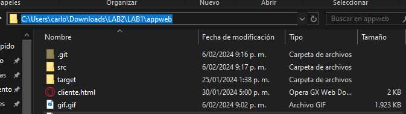
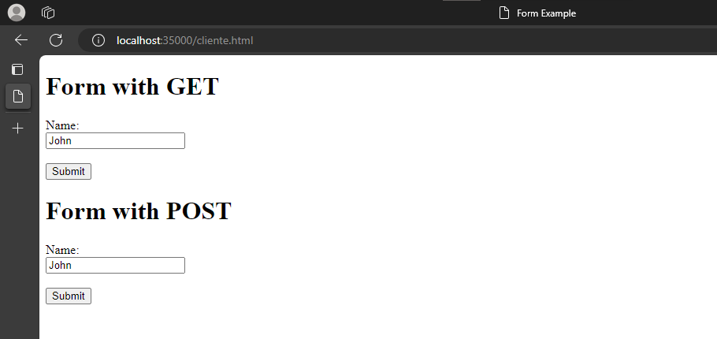
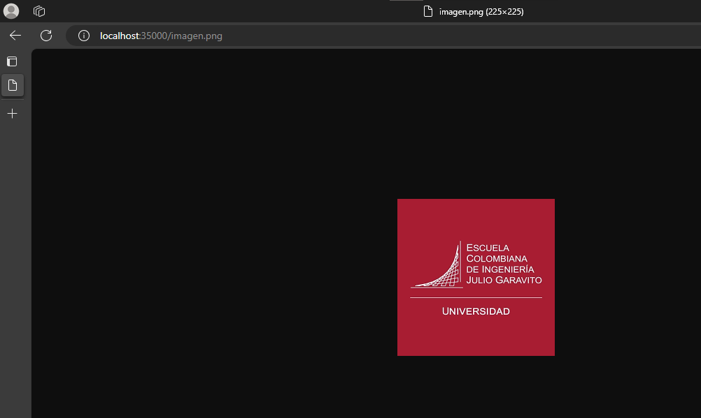
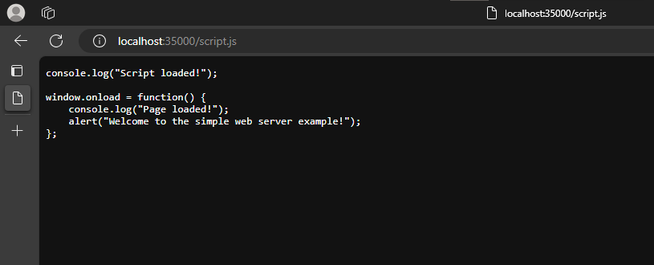
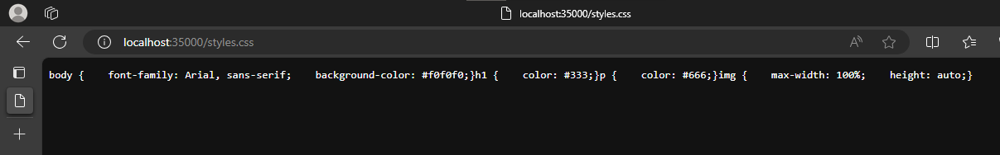
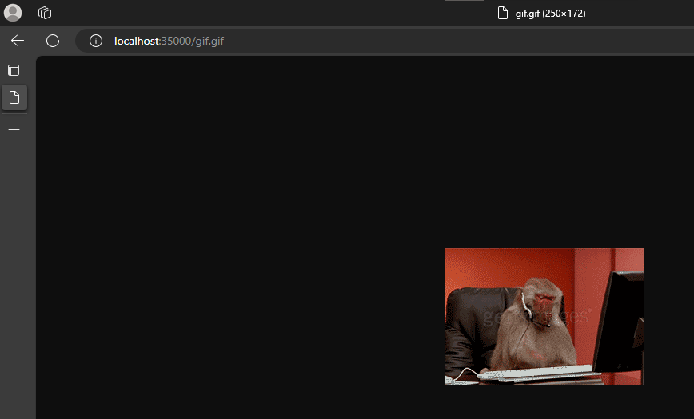

# Laboratorio 2 de AREP - Carlos Alberto Sorza Gómez

## Descripción
Este laboratorio se centra en la implementación de un servidor Web, el cual sirve para leer cualquier tipo de archivo y leerlo desde disco y mostrarlo desde cualquier navegador.

## Pre-requisitos
- JAVA
- Git
- Maven

## Instalación
1. Mediante el comando git clone https://github.com/CarlosSorza/AREP_Lab2.git
2. En la carpeta appweb abrimos una consola

3. Y ejecutamos mvn clean y luego mvn package

## Uso
1. Estando en el navegador de preferencia, en el buscador ponemos http://localhost:35000/cliente.html
    
    **Se observa que recibe cualquier tipo de archivo con la extensión .html**
2. Ahora, ponemos http://localhost:35000/imagen.png
    
    **Se observa que recibe cualquier tipo de archivo con la extensión .png**
3. Ahora, ponemos http://localhost:35000/script.js
    
    **Se observa que recibe cualquier tipo de archivo con la extensión .js**
4. Ahora, ponemos http://localhost:35000/styles.css
    
    **Se observa que recibe cualquier tipo de archivo con la extensión .css**
5. Ahora, ponemos http://localhost:35000/gif.gif
    
    **Se observa que recibe cualquier tipo de archivo con la extensión .png**
